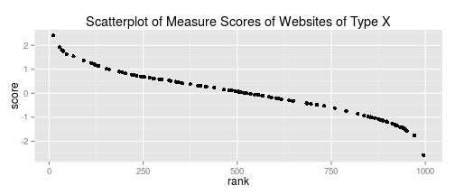
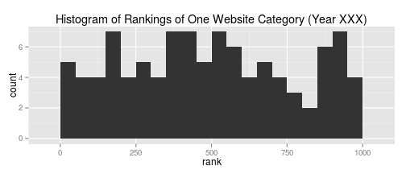

## <font color=purple>**Popular Websites in Global Attention Economy** <br></font>##
As more and more people get online, how has the status of different types of websites changed in the attention economy?<br>
<font family=verdana size=4px>[Find the App here!](https://angelaxwu.shinyapps.io/9Products)</font>

---
## Two Status Measures: ##
<font size=5px>

**Diversity of Userbase**: Internet users come from all over the world. Some websites' users frequent a wider range of other websites than others. For example, The userbase of e-map service is a far more diverse than that of an online dissertation repository.

**Centrality in User Attention**: Some websites are more central in the attention economy than others because whatever other sites different users also visit online, a large amount of users tend to use these websites. For example, Google is high on Centrality score as people of various online browing habits tend to use Google habitually.

</font>

---
## <font color=purple>Tab One</font> Measure Scores:  <font size=3px>##
This tab produces a scatter plot is based on the scores (of your chosen measure) of the 1000 most popular websites of a given year. The scores are ranked from high to low. You could view only websites belonging to certain basic categories. Sample code:</font>


```r
require(ggplot2) ## this is NOT the real dataset being used in the app
score <-rnorm(1000); score <- score[order(-score)] # randomly generate website scores 
dat <- data.frame(cbind(score, rank=1:1000)); 
dat_onecat <- dat[sample(1:1000,100,replace=F),] #generate data of one website type 
ggplot(dat_onecat,aes(x=rank, y=score)) + 
        geom_point(size=2) + 
        ggtitle(paste("Scatterplot of Measure Scores of Websites of Type X"))
```



--- 
## <font color=purple>Tab Two</font> Ranking Distribution:  <font size=3px>##
This tab generates histograms based on the rankings of scores (of a given measure) of the 1000 most popular websites of a given year. The distribution of rankings of a particular website category informs us of the internal diversity of this category. Sample code: </font>


```r
require(ggplot2) ## this is NOT the real dataset being used in the app
score <-rnorm(1000); score <- score[order(-score)] # randomly generate website scores 
dat <- data.frame(cbind(score, rank=1:1000)); 
dat_onecat <- dat[sample(1:1000,100,replace=F),] #generate data of one website type 
ggplot(dat_onecat, aes(x=rank)) + 
        geom_histogram(binwidth = 50) + 
        ggtitle(paste("Histogram of Rankings of One Website Type (Year XXX)"))
```



--- 
## <font color=purple>Tab Three</font> Website Types over Time: <font size=3px> ##
This tab gives a simple line plot based on the average rankings (of a given measure) of different website types over time. Due to how these measures are calculated, when we want to have a comparative view, it is more useful to examine their rankings rather than their absolute values. <br>
We need to be careful, though, to rely on the averages to discern how the status of different types of websites changed in the attention economy, because each category can be internally heterogeneous (see the 'Ranking Distribution' tab).</font> <br>
<font size=3px>(No sample code is presented for this tab.) </font>


--- 
## <font color=purple>More on Data / Measures</font> <font size=3px> ##

1. This app is an analytical summary of how people browse popular websites over time. <br><br>
2. The websites under consideration are the world's most popular 1000 websites at the year 2009, 2011, and 2013, respectively. <br><br>
3. The dataset contains each website's basic categories, as well as how each site is accessed by Internet users around the world. <br><br>
4. This dataset comes from a joint research project by scholars from the University of Missouri and the Chinese University of Hong Kong. <br><br>
5. The research is in progress, as is this app. Come back to check out for updates!<br><br>

<font family=verdana size=4px>[Find the App here!](https://angelaxwu.shinyapps.io/9Products)</font>
</font>
